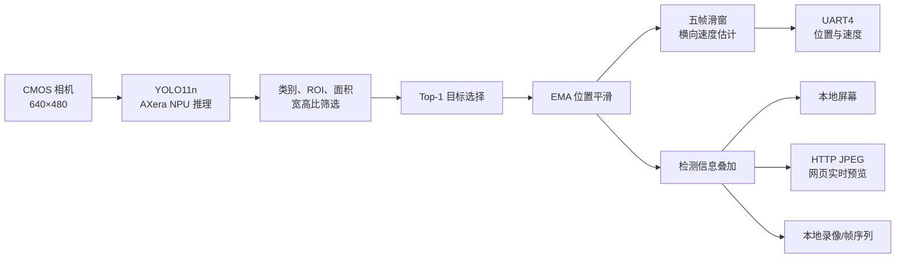

# 2026电赛H题钢球识别与图传，含YOLO11训练的数据集和结果

本项目是一套可直接部署到 Sipeed MaixCAM2 的钢球视觉方案，覆盖 YOLO11n 数据集与训练结果、模型转换、AXera NPU 推理、目标筛选、位置平滑、速度估计、UART 通信、网页实时预览与现场录像。仓库的不同开发分支保留了数据集、训练结果、ONNX/PT 模型、量化校准数据、Pulsar2 转换配置、转换脚本和完整 MaixVision 工程，便于复现、修改和二次开发。

> 当前工程输入分辨率为 640×480，仅检测 `steel_ball` 类别。本文中的运行频率均区分“配置目标值”和“板端实测值”；未提供统一测试集的数据不虚构 Precision、Recall 或 mAP。

## 1. 项目架构与分支说明

### 1.1 仓库结构

```text
maixcam2-steelball-deploy/
├── model/
│   ├── model.onnx                         # 固定输入 1×3×480×640 的 ONNX
│   └── steelball_yolo11n_640x480.pt       # 原始 YOLO11n 权重
├── calibration/
│   └── steelball_calibration_75.zip       # 75 张 INT8 量化校准图像
├── dataset/                               # YOLO11 数据集（训练分支）
├── runs/                                  # 训练参数、曲线和指标（训练分支）
├── config/
│   ├── yolo11n.npu.json                   # NPU2 转换配置
│   └── yolo11n.vnpu.json                  # NPU1/VNPU 转换配置
├── scripts/
│   ├── prepare.sh                         # 裁剪、校验 ONNX 并制作校准数据包
│   ├── convert.sh                         # 使用 Pulsar2 生成两类 AXModel
│   ├── deploy_autostart.sh                # 设备端自启动部署辅助脚本
│   └── sync_videos.sh                     # 录像同步辅助脚本
├── out/                                   # .mud 与已转换的 .axmodel
├── maix_project/                          # 可由 MaixVision 打开的设备端工程
│   ├── main.py                            # 检测、跟踪、串口、显示与录像主程序
│   ├── config.py                          # 相机、模型、跟踪及通信参数
│   ├── web_stream.py                      # HTTP/JPEG 实时预览
│   ├── player.html                        # JPEG 帧序列回放页面
│   └── app.yaml                           # MaixCAM2 应用打包清单
├── CODEX_CLI_TASK.md                      # Ubuntu 转换与验收任务说明
└── README.md
```

### 1.2 分支说明

| 分支 | 内容 | 适用场景 |
|---|---|---|
| `main` | GitHub 默认主分支；当前远端仍只有仓库初始化提交，尚未汇总其他分支成果 | 正式公开前应将选定的稳定代码、数据说明和本 README 合并到此分支 |
| `macbook-dataset-training` | YOLO11 数据集、标注、训练配置以及 `runs/` 中的训练曲线和结果 | 查看或复现训练过程，继续补充样本并重新训练 |
| `handoff` | 更新后的微调权重、ONNX 和转换交接材料 | 将最新训练结果交给 Ubuntu/Pulsar2 转换流程 |
| `agent/maixcam2-pulsar2-handoff` | 固定尺寸 ONNX、PT 权重、校准图片、Pulsar2 配置和转换脚本 | 需要自行复现模型转换，或修改量化/编译参数 |
| `agent/maixcam2-pulsar2-converted` | 已生成的 NPU/VNPU 模型，以及持续完善后的 MaixCAM2 运行工程、网页预览和录像功能 | 希望直接部署、运行或在现有视觉功能上继续开发 |

计划公开后，`main` 应作为项目总入口；当前在合并完成前，应按任务选择上述开发分支。不需要重新转换模型时，可直接使用 `agent/maixcam2-pulsar2-converted` 分支中的 `out/` 和 `maix_project/`；需要调整模型输入、量化数据或 NPU 模式时，从 handoff 分支的转换材料开始；需要查看数据集和训练结果时，切换到 `macbook-dataset-training`。

### 1.3 核心目录：`maix_project/`

`maix_project/` 是本仓库的重中之重：它不是转换过程中的临时目录，而是在 MaixCAM2 上制作、打包和运行应用的完整源代码。仅希望直接使用视觉功能的用户，应重点阅读和部署此目录。

| 文件 | 在设备应用中的作用 |
|---|---|
| `main.py` | 初始化模型、相机、显示与 UART，执行检测、筛选、跟踪、数据输出和录像控制 |
| `config.py` | 集中配置曝光、检测阈值、ROI、跟踪、串口、网页预览和本地录像开关 |
| `web_stream.py` | 在 MaixCAM2 上启动 HTTP 服务，向浏览器连续发送 JPEG 实时画面 |
| `player.html` | 回放本地保存的 JPEG 帧序列 |
| `app.yaml`、`app.png` | MaixCAM2 应用的元数据、图标与随包文件 |
| `models/` | 随应用部署的 `.mud`、NPU 和 VNPU 模型 |

使用 MaixVision 打开 `maix_project/` 后，可以直接运行 `main.py` 调试，也可依据 `app.yaml` 打包成 MaixCAM2 应用，实现脱离电脑独立启动。

### 1.4 系统数据流



## 2. 快速开始

### 2.1 直接部署到 MaixCAM2

将 `out/` 中同一版本的以下三个文件上传到设备的同一目录：

```text
/root/models/steelball_yolo11n_640x480/
├── steelball_yolo11n_640x480.mud
├── steelball_yolo11n_640x480_npu.axmodel
└── steelball_yolo11n_640x480_vnpu.axmodel
```

随后在 MaixVision 中打开 `maix_project/`，运行项目根目录的 `main.py`。模型描述文件与两个 AXModel 必须保持版本一致，不能只上传 `.mud`。

浏览器与 MaixCAM2 接入同一局域网后，访问：

```text
http://<MaixCAM2-IP>:8000/
```

### 2.2 Ubuntu 下重新转换模型

环境需要 Docker、Python 3 和已经导入本机的 Pulsar2 镜像：

```bash
git clone https://github.com/yiqingqqq/maixcam2-steelball-deploy.git
cd maixcam2-steelball-deploy
chmod +x scripts/*.sh
./scripts/prepare.sh
docker images | grep pulsar2
PULSAR2_IMAGE=pulsar2:6.0 ./scripts/convert.sh
```

若镜像标签不是 `pulsar2:6.0`，请用 `docker images` 显示的实际标签替换。`prepare.sh` 会检查 ONNX 输入输出形状并制作校准数据包；`convert.sh` 分别以 NPU2、NPU1 配置为 AX620E 生成模型。详细验收要求见 `CODEX_CLI_TASK.md`。

转换完成后，保留 `out/` 中同一组 `.mud`、NPU `.axmodel` 和 VNPU `.axmodel`。

## 3. 系统需求与硬件平台

视觉模块完成以下任务：

1. 在 640×480 图像中识别钢球并输出横向位置；
2. 对检测结果进行空间与时间滤波，减少误检和坐标跳变；
3. 估计钢球横向运动速度，并通过串口发送至控制器；
4. 以 MaixCAM2 应用形式独立运行，降低现场操作量；
5. 通过局域网提供实时画面，并保留现场录像或图像序列。

视觉端采用 MaixCAM2 的摄像头、AXera NPU、LCD、无线网络与 UART 外设。默认串口为 UART4，TX 使用 A21，RX 使用 A22，波特率为 115200 bit/s，可连接 STM32、ESP32 等控制器。

`app.yaml` 统一打包模型、配置、主程序、网页服务和回放页面。模型、相机与串口初始化均提供最多 5 次重试，每次失败后等待 1 s；模型加载设置多个候选路径，以兼容应用目录和设备固定目录。

## 4. 目标检测与 NPU 部署

### 4.1 YOLO11n 钢球检测

本项目使用轻量化 YOLO11n 单类别检测网络。模型输入为 `1×3×480×640`，输出类别为 `steel_ball`。Pulsar2 将 ONNX 转换为 MaixCAM2 可加载的 `.mud` 与 AXera `.axmodel`，由 NPU 执行推理。

转换配置采用 64 张图片参与 MinMax 量化校准，并开启精度分析；编译器执行三级输出检查，余弦相似度门槛配置为 0.9。仓库同时保留 75 张校准图片，便于重建校准数据包。

### 4.2 候选目标筛选

网络输出按以下顺序处理：

1. 仅保留 `class_id = 0` 的钢球候选；
2. 仅保留中心点位于有效 ROI 的候选；
3. 根据面积范围排除过小噪声或过大物体；
4. 根据宽高比排除明显不符合球体投影的候选；
5. 对几何条件合格的候选保留置信度最高者。

框面积与宽高比分别为：

$$A=w\times h,\qquad r=\frac{w}{h}.$$

当前配置最大框面积为 8000 px²，宽高比范围为 0.5～2.0，推理置信度阈值为 0.1，NMS IoU 阈值为 0.50。较低的置信度阈值用于优先保留弱光、拖影下的候选，再由几何与连续性约束抑制明显误检。

### 4.3 检测链路迭代

| 阶段 | 主要变化 | 可追溯参数或产物 |
|---|---|---|
| V1 基础检测 | 完成 YOLO11n 单类别模型导出和 NPU/VNPU 转换 | 640×480；类别数 1 |
| V2 几何筛选 | 增加 ROI、面积、宽高比和 Top-1 筛选 | 初始 conf 0.40；IoU 0.50 |
| V3 模型重构 | 更新转换参数并重新生成 NPU/VNPU 模型 | NPU 约 2.7 MiB；VNPU 约 3.1 MiB |
| V4 灵敏度调整 | 降低推理阈值，由后处理承担误检抑制 | 当前 conf 0.1；最大面积 8000 px² |
| V5 时域优化 | 加入位置平滑、短时保持与五帧速度估计 | EMA 系数 0.35；速度窗口最多 5 帧 |

## 5. 位置平滑、运动估计与短时漏检处理

设原始检测中心为 $(x_k^{raw},y_k^{raw})$，EMA 平滑位置为 $(x_k,y_k)$：

$$x_k=\alpha x_k^{raw}+(1-\alpha)x_{k-1},$$

$$y_k=\alpha y_k^{raw}+(1-\alpha)y_{k-1}.$$

默认平滑系数为 $\alpha=0.35$。较小的系数能减少抖动，但会增加跟踪滞后，应根据控制环带宽和钢球最大速度整定。

系统保留最近最多 5 个平滑横坐标及时间戳，以窗口首尾点估计平均横向速度：

$$v_x=\frac{x_n-x_0}{t_n-t_0}.$$

短时丢失目标时，系统可在有限窗口内沿用或预测上一有效状态，避免单帧漏检直接造成控制量突变；超过超时门槛后清空旧目标并发送无目标标志。下位机仍应实现独立的数据超时保护。

## 6. 串口通信

程序支持开机即运行，不依赖额外握手指令。默认串口参数如下：

| 参数 | 默认值 |
|---|---:|
| 设备 | `/dev/ttyS4` |
| 引脚 | A21/TX，A22/RX |
| 波特率 | 115200 bit/s |
| 配置输出周期 | 33 ms |
| 配置输出频率 | 30 Hz |

当前两字段协议为：

```text
$position,speed\r\n
```

目标无效或数据过期时发送：

```text
$-1,-1\r\n
```

未标定模式下，`position` 直接使用图像横坐标；启用标定后可转换为轨道物理位置。串口的 30 Hz 是调度目标值，实际稳定性仍取决于相机采集、推理、绘制与编码耗时。

## 7. 网页实时预览

设备在 TCP 8000 端口启动轻量级 HTTP 服务。检测结果叠加后被编码为独立 JPEG，浏览器通过连续更新图片获得实时观感；这一本质是 JPEG 图片的高速播放，而不是 H.264/MP4 等帧间编码视频。

主通道使用 `multipart/x-mixed-replace` 连续发送 JPEG，代码中的推送间隔为 0.1 s，对应约 10 FPS 的配置上限。若浏览器不兼容或连接中断，页面回退到 `/frame.jpg` 单帧轮询；成功后约 200 ms 请求下一帧，失败后约 500 ms 重试。

HTTP 服务与检测主循环解耦，网页断线不会终止检测和串口输出。图传面向监控和调试，不参与控制闭环。

## 8. 录像与应用模块

是否在 MaixCAM2 本地保留录像由 `config.py` 中的开关决定：

```python
RECORDING = {
    "enabled": False,  # 是否开启录像支持
}
```

当 `enabled=False` 时，程序不在 MaixCAM2 本地持续保存录像，因此不会因为该功能产生大量帧文件或额外占用本地存储空间，检测、串口和网页预览仍可正常运行。只有将其改为 `True` 时，才会启用本地留档；JPEG 帧序列方案使用容量为 2 的异步队列写盘，存储跟不上时优先丢弃较旧待写帧，避免磁盘 I/O 阻塞检测主循环。启用前应根据记录时长评估存储容量。

| 模块 | 主要功能 |
|---|---|
| `main.py` | 模型、相机、显示、串口初始化及视觉主循环 |
| `config.py` | 相机、模型、ROI、跟踪、串口、录像和调试参数 |
| `web_stream.py` | HTTP 页面、JPEG 连续推送与单帧回退 |
| `player.html` | JPEG 帧序列回放 |
| `app.yaml` | MaixCAM2 应用元数据和打包文件列表 |
| `models/` | 应用内置的 `.mud` 与 AXera 模型 |

## 9. 本方案优越性分析与单一不足

### 9.1 优越性：基于仓库产物与代码参数的工程评估

以下数据均由当前仓库文件、配置和脚本静态评估得到，不替代 MaixCAM2 板端基准测试：

| 维度 | 评估数据 | 结论 |
|---|---:|---|
| 输入规模 | 640×480，共 307,200 像素/帧 | 在小目标细节与嵌入式计算量之间取得平衡 |
| 类别规模 | 1 类，`steel_ball` | 后处理可围绕单目标场景做强约束，链路简单 |
| 原始权重 | PT 5,531,217 B，约 5.27 MiB | YOLO11n 适合端侧部署 |
| ONNX | 10,562,159 B，约 10.07 MiB | 固定输入输出，转换脚本可自动校验形状 |
| NPU 模型 | 2,857,509 B，约 2.73 MiB | 相比 ONNX 体积减少约 72.9% |
| VNPU 模型 | 3,200,557 B，约 3.05 MiB | 相比 ONNX 体积减少约 69.7% |
| 量化数据 | 仓库 75 张，实际配置使用 64 张 | 校准输入可复现，且保留 11 张余量 |
| 编译验收门槛 | `check=3`，输出余弦相似度 ≥ 0.9 | 转换过程包含明确的数值一致性门槛 |
| 串口调度 | 33 ms/次，目标 30 Hz | 控制数据更新周期在配置层面明确可调 |
| 网页预览 | 主通道约 10 FPS；回退轮询约 5 FPS | 兼顾局域网带宽、CPU 占用和浏览器兼容性 |
| 启动容错 | 模型、相机、串口最多重试 5 次，间隔 1 s | 对设备启动时序波动有基础容错能力 |
| 写盘隔离 | 异步队列容量 2 | 存储变慢时优先保护检测主循环，不无限堆积帧 |

训练数据集共记录 572 张图像，采用 YOLO11n、640 像素训练尺寸、batch size 16，在 Apple MPS 上训练 50 轮。第 50 轮结果如下：

| Precision | Recall | mAP@0.5 | mAP@0.5:0.95 |
|---:|---:|---:|---:|
| 0.98234 | 0.92308 | 0.98786 | 0.72543 |

以上结果来自 `finetune_20260731_v2/results.csv`。需要特别说明：当前 `data.yaml` 的 `train` 和 `val` 均指向同一个 `train.txt`，并非相互独立的数据划分，因此这些指标适合用于检查训练是否收敛和比较同一配置下的实验，不应直接当作未知场景下的泛化性能。

本地还保留了 6 段带逐帧时间戳 CSV 的钢球 H.264 录像。静态统计共覆盖 6909 个记录帧，六段平均采集速率为 29.95 FPS，范围为 29.93～29.98 FPS；按理想 30 FPS 时间轴估算约缺少 21 帧，对应估算录像掉帧率约 0.30%。该值由时间戳间隔推算，受首帧初始化和调度抖动影响，属于工程评估值而非编码器硬件计数。

从工程完整性看，本项目不只提供一个权重文件，而是同时公开训练产物、固定形状 ONNX、量化图片、双 NPU 模式配置、转换脚本、模型描述文件和设备端应用。模型转换与运行链路均可追溯，参数集中在 `config.py`，更适合复现实验和针对具体赛道继续调参。

### 9.2 单一不足：低延迟优先带来的部署与录像取舍

为了追求数据解算和传输的低延时，当前工程将快门设置为 5000 μs。较短曝光有利于减少高速钢球的运动拖影，但在工频照明下，将 `RECORDING["enabled"]` 设为 `True` 后保存的录像可能出现明暗频闪。网页端采用独立 JPEG 图片高速播放，不依赖帧间编码，实时预览无此屏闪问题；因此当前方案更适合“低延时控制 + 网页观察”，对需要高质量连续录像的场景仍需在补光、曝光时间或录像方式之间重新权衡。

此外，MaixHub 在线转换在本项目上会卡在初始化阶段，所以模型转换需要在 Ubuntu 环境中借助 Pulsar2 Docker 镜像完成。这增加了首次部署的环境准备成本，但仓库已经提供 `prepare.sh`、`convert.sh`、NPU/VNPU 配置和已转换产物；只做设备端部署时无需重复转换。

## 10. 结论

本项目在 MaixCAM2 上集成了钢球检测、候选筛选、位置平滑、速度估计、UART 通信、本地显示、网页 JPEG 实时预览和录像留档，并公开了从模型到设备应用的完整转换与部署材料。分支将“转换交接材料”和“已转换可运行工程”区分开，既可直接使用，也便于修改模型或量化参数后复现部署。

现有仓库能够支撑完整的视觉链路学习与二次开发，但检测准确率、板端推理帧率、端到端延时、串口实际频率和录像丢帧率仍应在统一场景、统一照明和统一固件下实测后发布，避免把配置目标值当作硬件测量结果。

## 参考资料

- [MaixCAM2 AI 模型转换文档](https://wiki.sipeed.com/maixpy/doc/zh/ai_model_converter/maixcam2.html)
- [项目仓库](https://github.com/yiqingqqq/maixcam2-steelball-deploy)
